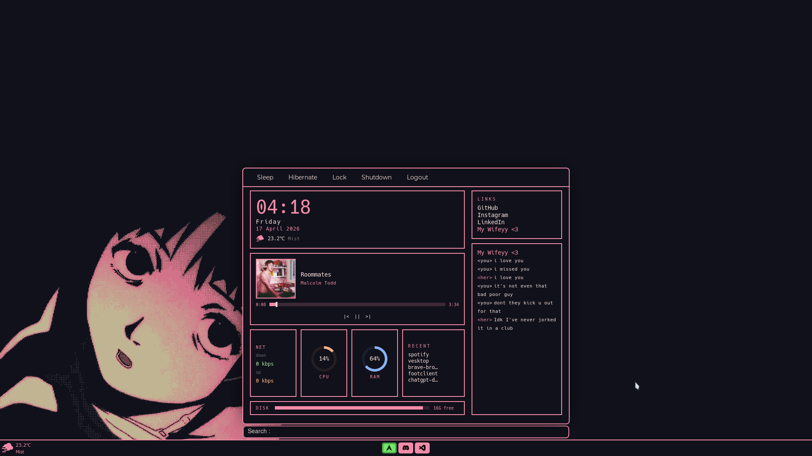
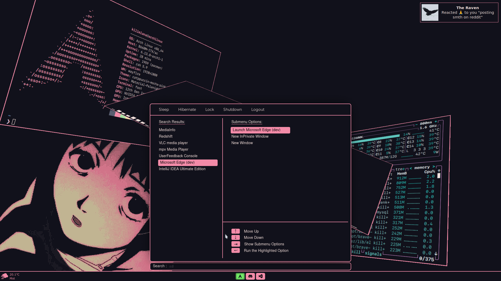
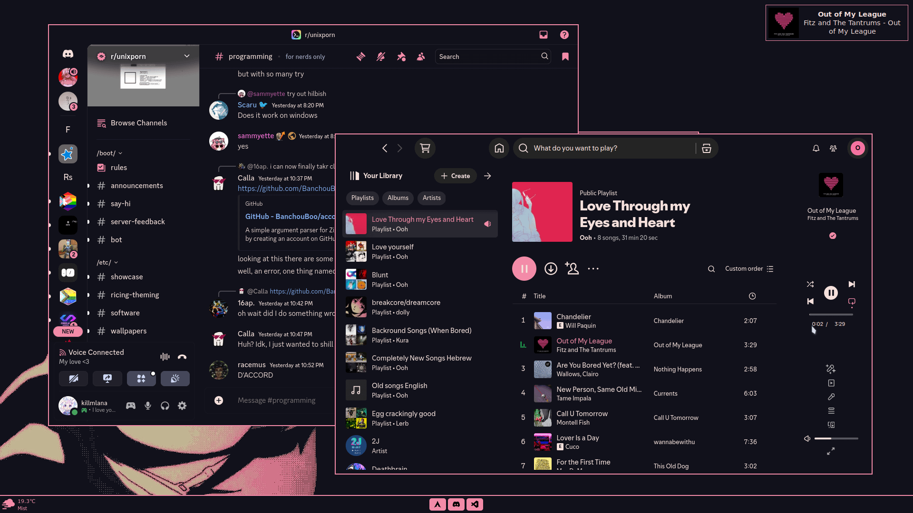
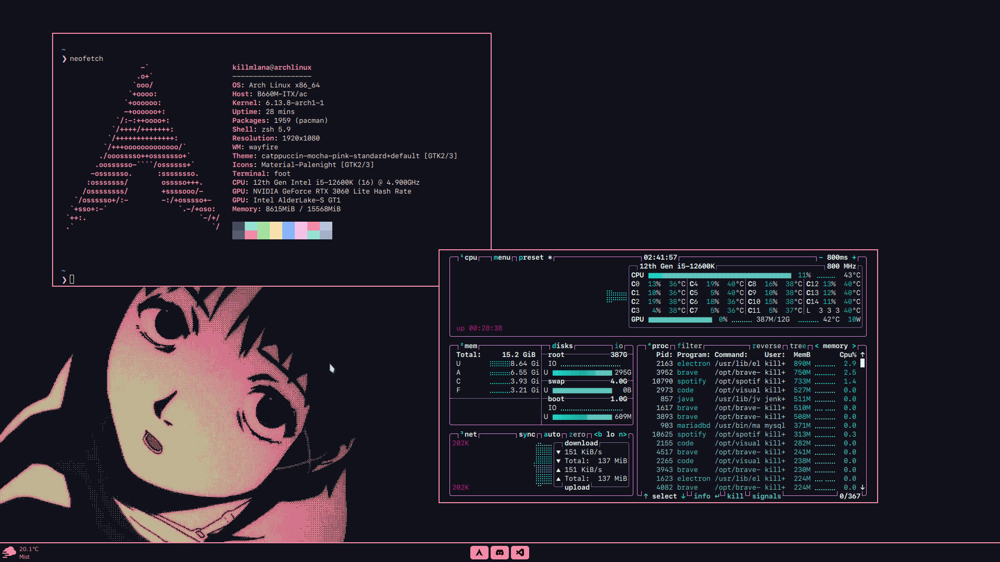

# eww-dotfiles

Custom [Eww](https://github.com/elkowar/eww) widgets for Wayland — a full desktop shell with a taskbar, start menu, app launcher, dashboard, and Instagram DM integration. Built for [Wayfire](https://wayfire.org/) with Catppuccin Mocha theming.











## Features

- Bottom bar with weather, taskbar icons (open/minimized/closed state), and start menu toggle
- Start menu with keyboard-navigable fuzzy app search (KMP matching), submenu options per app, and a keybind legend
- Dashboard with clock, weather, music player controls (playerctl), CPU/RAM/disk/network stats, recent apps, quick links, and Instagram DMs
- Wayland-native app launcher (`wl-launch`) with `xdg-activation-v1` startup notification cursor
- Pacman hook to auto-refresh the app cache on install/remove

## Dependencies

| Dependency | Purpose |
|---|---|
| [eww](https://github.com/elkowar/eww) (Wayland) | Widget system |
| [Wayfire](https://wayfire.org/) + `wfctl` | Compositor, window management |
| `g++`, `gcc`, `make` | Building C/C++ helpers |
| `boost` (filesystem) | Desktop file scanning |
| `wayland-client` | `wl-launch` startup notifications |
| `playerctl` | Music controls |
| `perl` + `Linux::DesktopFiles`, `Tree::Trie`, `JSON`, `File::Slurp` | App search |
| `python3` + `wayfire` module | Taskbar daemon |
| Hack, Nimbus Sans, Montserrat, Verdana | Fonts |

`nlohmann/json` is vendored in `scripts/nlohmann/`.

## Install

```bash
git clone https://github.com/killmlana/eww-dotfiles.git
cd eww-dotfiles
./install.sh
```

Or manually:

```bash
make all
make install
```

Installs to `~/.config/eww/`.

## Configuration

Before running, edit these for your setup:

| File | What to change |
|---|---|
| `eww.yuck` | Social links, monitor width (`1920px`) in `bartest` and `dismiss-layer` |
| `scripts/taskbar-daemon` | `OUT_W`, `OUT_H`, `OUTPUT_NAME` |
| `scripts/taskbar-ctl.cpp` | Resolution, output name |
| `scripts/dashboard/insta-*` | Instagram usernames and thread ID |
| `scripts/weather_day`, `weatherText`, `temperature` | RapidAPI key and city |
| `scripts/eww-app-cache.hook` | Absolute path (for pacman hook) |

The taskbar app list lives in `eww.yuck` (`defvar tasklist`) and the `APPS` maps in `scripts/taskbar-daemon` and `scripts/taskbar-ctl.cpp`.

## Usage

```bash
eww daemon
eww open bartest
```

The start menu is toggled by `scripts/toggle-startmenu`. Bind it to a key in your Wayfire config.

## Pacman Hook

Auto-refresh the app cache when packages change:

```bash
sudo cp ~/.config/eww/scripts/eww-app-cache.hook /etc/pacman.d/hooks/eww-app-cache.hook
```

Edit the `Exec` path in the hook to your install location.

## Project Structure

```
eww-dotfiles/
├── eww.yuck                          # Widget definitions
├── eww.scss                          # Styling (Catppuccin Mocha)
├── Makefile
├── install.sh
├── images/icons/
│   ├── apps/                         # Taskbar icons (normal)
│   ├── apps-pink/                    # Taskbar icons (inactive)
│   ├── system/                       # Arch logo, decorations
│   └── weather/                      # Weather condition icons
└── scripts/
    ├── toggle-startmenu              # Open/close start menu
    ├── cacheApps                     # Perl app search engine
    ├── selection-info.cpp            # Desktop file → JSON cache
    ├── kbselection-daemon.cpp        # Keyboard navigation daemon (FIFO)
    ├── kbselection.cpp               # Legacy keyboard nav helper
    ├── search-result-menu-init.cpp   # Init search result panel
    ├── search-info-menu-init.cpp     # Init submenu panel
    ├── active-selection-info-menu-init.cpp
    ├── taskbar-daemon                # Python taskbar state manager
    ├── taskbar-ctl.cpp               # Taskbar click handler
    ├── wl-launch.c                   # Wayland app launcher
    ├── refresh-app-cache             # Rebuild app cache
    ├── eww-app-cache.hook            # Pacman hook
    └── dashboard/
        ├── taskbar-state             # Poll window states
        ├── recent-apps               # Recently focused apps
        ├── cpu, ram, disk, disk-avail, net-speed, volume
        ├── music-title, music-artist, music-status, music-art
        ├── music-position, music-length, music-position-fmt, music-length-fmt
        ├── insta-daemon              # Instagram DM poller (CDP)
        ├── insta-cdp, insta-dms, insta-unread, insta-native-host
        └── ...
```

## Tech Stack

| Component | Technology |
|---|---|
| Widgets | Eww (Yuck + SCSS) |
| Compositor | Wayfire |
| App search | Perl (KMP matching) |
| Keyboard nav | C++ FIFO daemon |
| Taskbar | Python + Wayfire IPC |
| App launcher | C + Wayland `xdg-activation-v1` |
| DM integration | Python + Chrome DevTools Protocol |
| Theme | Catppuccin Mocha |
